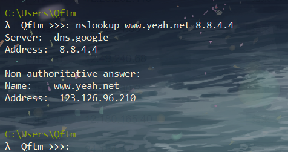

## 绕过CDN查找真实IP

在确认了目标确实用了CDN以后，就需要绕过CDN寻找目标的真实IP，下面介绍一些常规的方法。

### 内部邮箱源

一般的邮件系统都在内部，没有经过CDN的解析，通过利用目标网站的邮箱注册、找回密码或者RSS订阅等功能，查看邮件、寻找邮件头中的邮件服务器域名IP，ping这个邮件服务器的域名,就可以获得目标的真实IP。

注意：必须是目标自己的邮件服务器，第三方或公共邮件服务器是没有用的。


### 国外请求

很多时候国内的CDN对国外得覆盖面并不是很广，故此可以利用此特点进行探测。通过国外代理访问就能查看真实IP了，或者通过国外的DNS解析，可能就能得到真实的IP。

#### 国际Ping

国际ping测试站点

- [ipip](https://tools.ipip.net/newping.php)

- [ASM](https://asm.ca.com/en/ping.php)

测试站点：`www.yeah.net`


#### 国外DNS解析

- [世界各地DNS服务器地址大全](http://www.ab173.com/dns/dns_world.php)

测试站点：`www.yeah.net`

美国加利福尼亚州山景市谷歌公司DNS服务器： `8.8.4.4`



### 分站域名&C段查询

很多网站主站的访问量会比较大，所以主站都是挂CDN的，但是分站可能没有挂CDN,可以通过ping二级域名获取分站IP， 可能会出现分站和主站不是同一个IP但在同一个C段下面的情况，从而能判断出目标的真实IP段。

#### 分站域名

具体见上面 **<收集子域名信息>** 部分


#### C段查询

* 在线查询

```
https://phpinfo.me/bing.php
```


* 工具

`K8_C段旁注工具6.0`、`nmap`、`IISPutScanner`、`小米范WEB查找器` 等

`小米范WEB查找器`：http://pan.baidu.com/s/1pLjaQKF


* 网络资产搜索引擎

Fofa、Shodan、ZoomEye

利用这些网络空间资产搜索引擎来搜索暴露在外的端口信息

利用语法搜索C段信息


### 网站漏洞

通过网站的信息泄露如phpinfo泄露，github信息泄露，命令执行等漏洞获取真实ip。

#### 一些测试文件

phpinfo、test等


#### SSRF漏洞

服务器主动向外发起连接，找到真实IP地址

### 查询域名解析记录

一般网站从部署开始到使用cdn都有一个过程，周期如果较长的话 则可以通过这类历史解析记录查询等方式获取源站ip，查看IP与域名绑定的历史记录，可能会存在使用CDN前的记录。

在线网站查询

- [dnsdb](https://www.dnsdb.io)

- [NETCRAFT](https://sitereport.netcraft.com/?url=)

- [viewdns](https://viewdns.info/)

- [threatbook](https://x.threatbook.cn/)

- [securitytrails](https://securitytrails.com/)


### 目标网站APP应用

如果目标网站有自己的App，可以尝试利用Fiddler或Burp Suite抓取App的请求，从里面找到目标的真实IP。

### 网络空间引擎搜索

shodan、FOFA、zoomeye